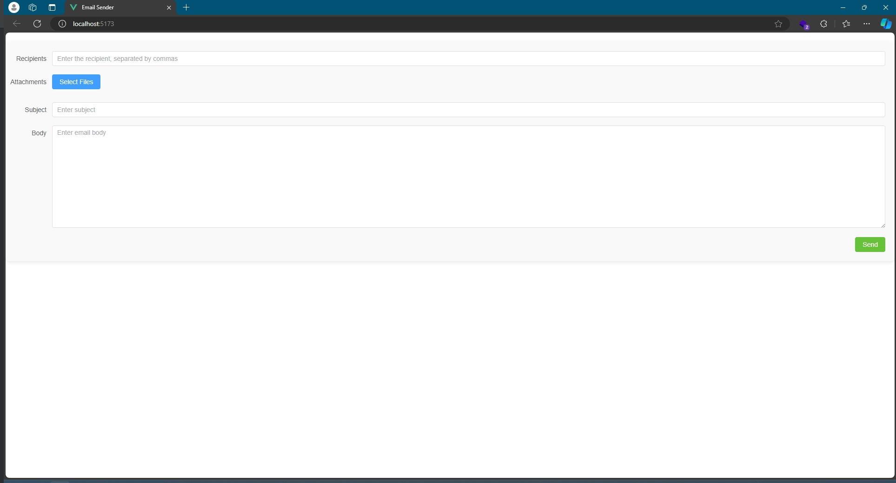

# mailbot-web

このプロジェクトは、Viteを使ってVue 3の開発を始めるためのもの。

## 開発環境

```
node v22.12.0  
Webstorm 2024.3
```

## プロジェクトセットアップ

```sh
npm install
```

### 開発用コンパイルとホットリロード

```sh
npm run dev
```

### 本番用コンパイルと最小化

```sh
npm run build
```

### ビルド方法

```
1. npm run buildを実行してビルドを行う。生成されたdistとDockerfileを同じディレクトリに配置。
2. docker build -t xxx:latest . を実行。
3. nginx.confを指定したディレクトリに配置（Podにマウント）。
```

### docker-composeでのデプロイ

```
version: '3.8'
services:
  mailbot-web:
    container_name: mailbot-web
    image: mailbot-web:latest
    ports:
      - 80:80
    volumes:
      - /root/nginx.conf:/etc/nginx/nginx.conf
```

```sh
docker-compose up -d
```

### Kubernetesでのデプロイ

```
apiVersion: apps/v1
kind: Deployment
metadata:
  name: mailbot-web
  namespace: test
spec:
  replicas: 1
  revisionHistoryLimit: 1
  selector:
    matchLabels:
      app: mailbot-web
  template:
    metadata:
      labels:
        app: mailbot-web
    spec:
      containers:
        - name: mailbot-web
          image: mailbot-web:latest
          imagePullPolicy: Never
          ports:
            - containerPort: 80
              protocol: TCP
          volumeMounts:
            - name: mailbot-web-config
              mountPath: /etc/nginx/nginx.conf
          livenessProbe:
            tcpSocket:
              port: 80
            initialDelaySeconds: 30
            periodSeconds: 10
            timeoutSeconds: 3
      volumes:
        - name: mailbot-web-config
          hostPath:
            path: /root/nginx.conf
      affinity:
        podAntiAffinity:
          requiredDuringSchedulingIgnoredDuringExecution:
            - labelSelector:
                matchExpressions:
                  - key: app
                    operator: In
                    values:
                      - mailbot-web
              topologyKey: "kubernetes.io/hostname"
---
apiVersion: v1
kind: Service
metadata:
  name: mailbot-web
  namespace: test
spec:
  type: NodePort
  ports:
    - port: 80
      nodePort: 30000
      targetPort: 80
  selector:
    app: mailbot-web
```

```sh
kubectl apply -f mailbot-web.yaml
```
